# Movie-Data-Quality-and-Ingestion-Pipeline
This project builds a scalable, automated data pipeline to ensure only high-quality movie data is ingested into Redshift for analytics, leveraging AWS Glue for transformation and data quality enforcement.

## Project Overview
The goal of this project is to ingest high-quality movie data into Redshift for analysis.  Raw movie data is stored in an S3 bucket.  We use AWS Glue to orchestrate the ETL process, including data quality checks and transformations.  Records failing quality checks are stored separately for review, while clean data is loaded into Redshift.  The pipeline also incorporates monitoring and notification using CloudWatch and EventBridge.

## Tech Stack
`Amazon S3` – Source & Storage for bad records

`AWS Glue Crawler` – Schema registration for source & target

`AWS Glue Catalog` – Centralized metadata management

`AWS Glue Data Quality` – Rule-based quality checks

`AWS Glue Visual ETL` – No-code data transformation pipeline

`Amazon Redshift` – Target Data Warehouse

`AWS CloudWatch` – Monitors the Glue job's performance and logs metrics.

`Amazon SNS (Simple Notification Service)` – Job Failure/Success Notifications

## Business Use Case:
Movie datasets often contain incomplete, inaccurate, or low-quality records.
Poor data quality leads to misleading insights in analytics and recommendation systems.
High-quality movie data improves business decisions for streaming platforms, recommendation engines, and data-driven analysis.

## Solution Approach
- Source Data: Raw movie data is stored in S3.
- Schema Registration: Glue Crawler registers both source and target schemas in Glue Catalog.
- Data Quality Checks: AWS Glue evaluates movie ratings and data completeness.
- Conditional Routing:
  Good Records → Ingested into Amazon Redshift.
  Bad Records → Stored in S3 for further analysis.
- Monitoring & Notifications:
- Data quality results sent to CloudWatch.
- EventBridge triggers an SNS notification for failures.

## Architecture

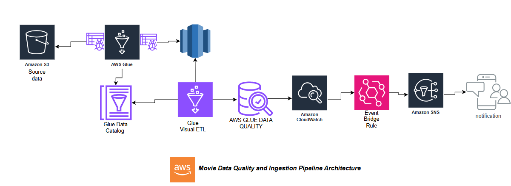

**Data flow**
- Raw movie data is residing in an Amazon S3 bucket. 
- This data is then cataloged using AWS Glue Crawlers, which infer the schema and store it in the Glue Data Catalog.
- AWS Glue Visual ETL orchestrates the data transformation process, reads the schema from the Glue Data Catalog, transforms the data which is appended in Redshift.
- AWS CloudWatch monitors the Glue job's performance. 
- AWS EventBridge triggers rules based on the job status (success or failure), and Amazon SNS sends email notifications to alert stakeholders about the job's outcome.

## Execution Steps

## 1. AWS Bucket Structure: 
Folders used in the data pipeline: 
- source_data (for raw input) 
- rules_outcome (for data quality rule results)
- records_failing_validation_rules (for records that failed quality checks)
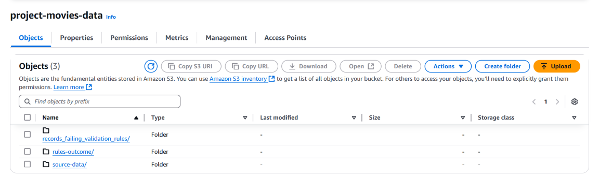

## 2. Redshift table creation:
This image shows the SQL commands used to create the database, schema, and the target table in the Redshift cluster, showing that the target table exists and is ready to receive data.
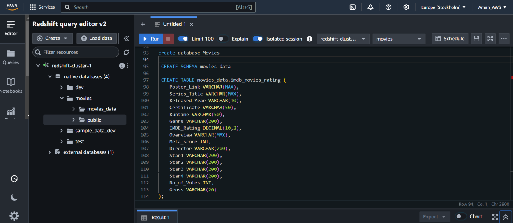

## 3. glue database:
Creating Glue database movied_db in the Glue Data Catalog. 
It shows the two tables registered within this database: the source table representing the raw movie data in S3 and the target table representing the Redshift table. 
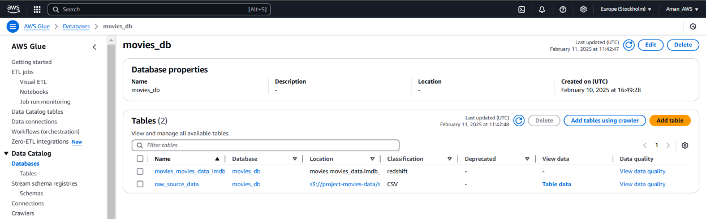

## 4. crawler creation (source): 
This image captures the configuration of the Glue crawler responsible for reading and registering the schema of the raw movie data in the source_data folder of S3 bucket.  
It shows settings like the crawler's name, data source (S3 path), and output database (movied_db).
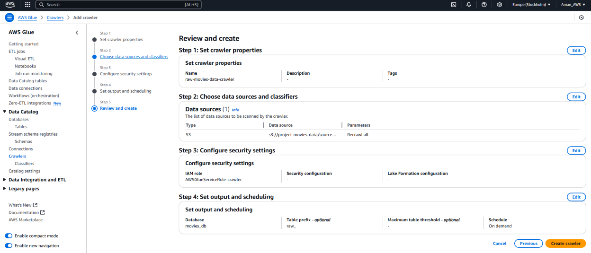

## 5. crawler creation (target): 
Similar to the previous image, this one shows the configuration of the Glue crawler that targets the Redshift table. 
It demonstrates how the crawler connects to Redshift, infers the schema of the target table, and registers it in the Glue Data Catalog (movied_db).
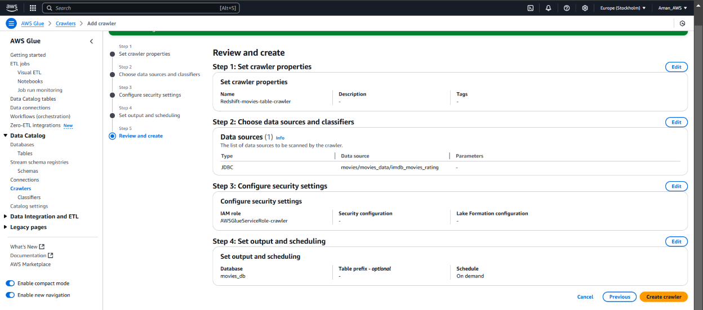

## 6. Visual Glue ETL 
This is the core visual representation of Glue ETL job. 
The image shows the different transformation steps (data quality checks, routing, dropping columns), the data sources (Glue Catalog tables), and the data targets (S3 buckets, Redshift), illustrating the data pipeline's logic.
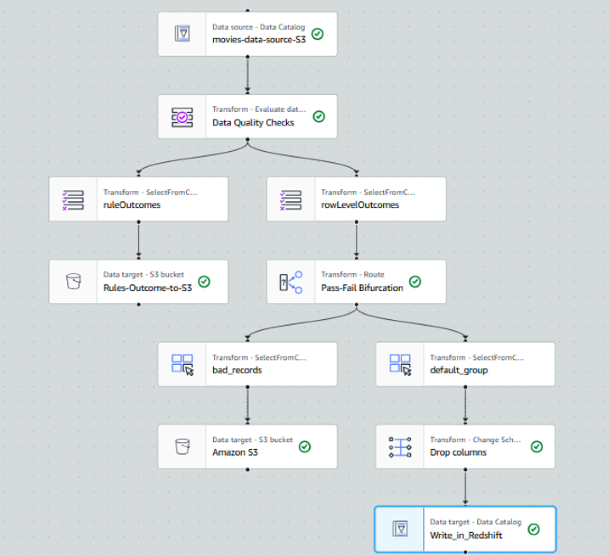

## 7. Glue ETL Successful 
This image provides evidence of a successful execution of the Glue ETL job. 
It shows metrics like the job's runtime,worker type, number of worker and other metrics." This confirms the pipeline's functionality.
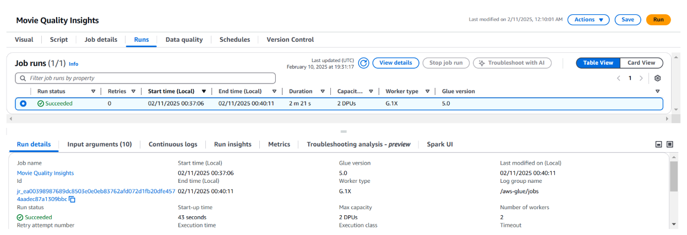

## 8. Successful ingestion of data 
This image displays the results of a query executed against the Redshift table after the Glue job has run. 
It confirms that data has been successfully loaded and is accessible for analysis.
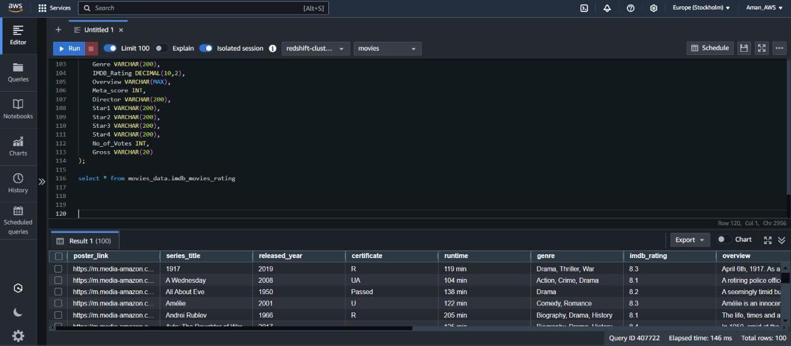

## 9. Bad Records
This image shows the contents of the records_failing_validation_rules folder in S3 bucket. 
It demonstrates that records that failed the data quality checks have been successfully isolated and stored for further analysis.
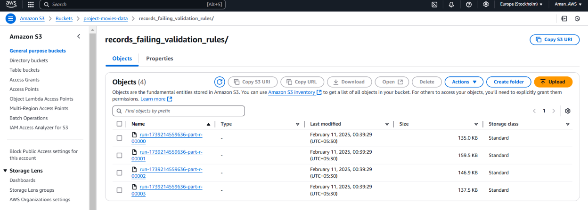

## 10. Event bridge rule for alerts
This screenshot shows the configuration of the EventBridge rule that triggers notifications based on the Glue job's state changes (success or failure).  
It shows the event pattern that matches Glue job status events and the target of the rule (SNS topic).
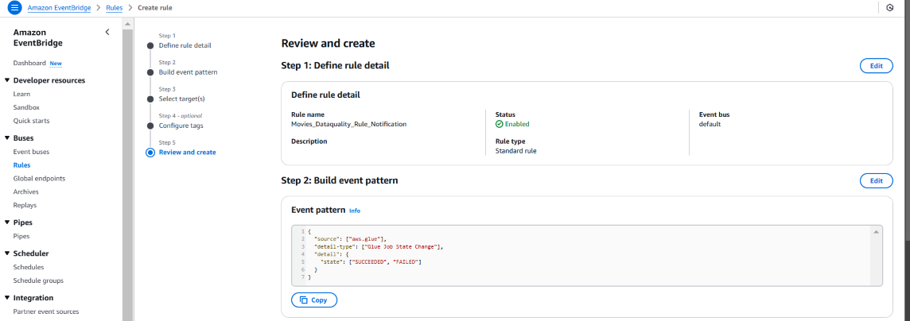

## 11. Email Notification 
This image shows the email notification received via SNS after a successful Glue job run. 
It confirms that the monitoring and notification system is working as expected.
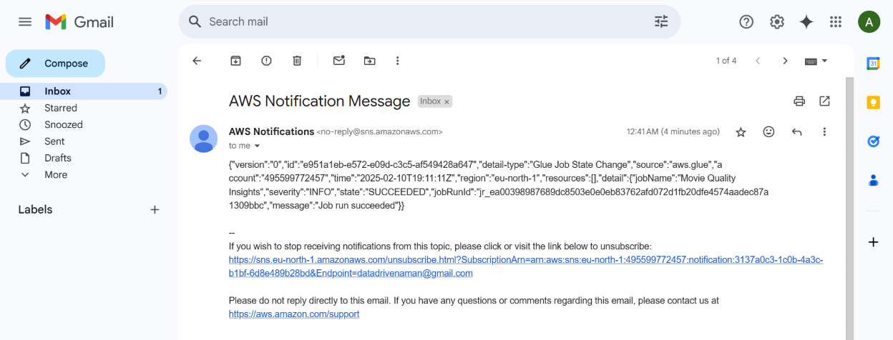

## Results & Key Takeaways

This project successfully demonstrates the creation of a robust and efficient data pipeline for movie data analysis using AWS services.

**Data Quality Implementation:**  Successfully implemented data quality checks to identify and isolate bad records, demonstrating the ability to ensure data accuracy for downstream analysis.

**Automated ETL Pipeline Development:** Built an automated ETL pipeline using AWS Glue Visual ETL, showcasing the efficiency and speed of no-code development for data ingestion and transformation.

**Data Governance Best Practices:** Adhered to data governance principles by separating good and bad records into distinct S3 locations, facilitating efficient data remediation and ensuring data integrity.

**Monitoring and Notification System:** Implemented a monitoring and notification system using CloudWatch and EventBridge, showcasing the ability to ensure pipeline reliability and proactively address potential issues.

**Hands-on AWS Experience:** This project provided practical experience with key AWS data engineering services, including Glue, S3, Redshift, CloudWatch, and EventBridge, SNS in solidifying understanding of cloud-based data engineering principles.
